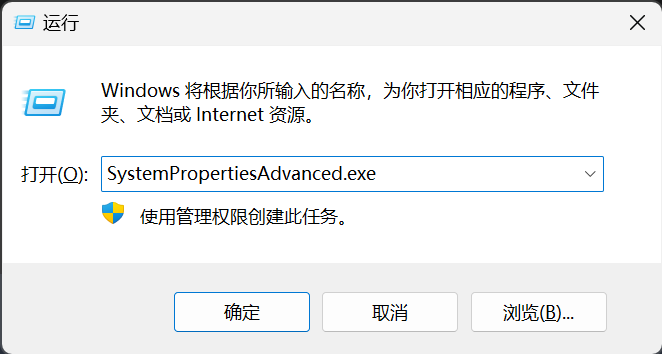
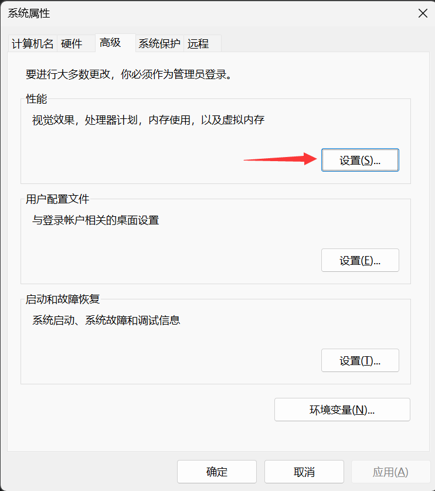
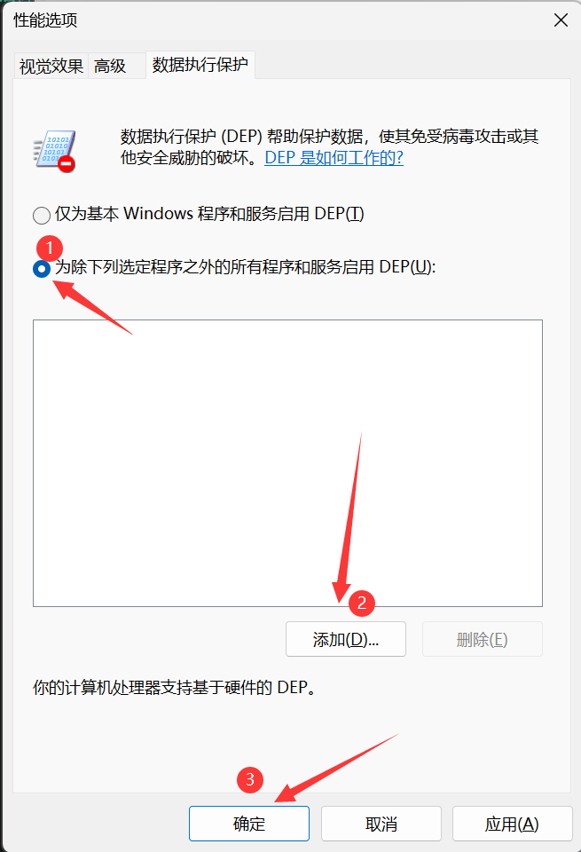

#### 如何添加DEP数据保护
1. Windows+R键 打开 `运行` 对话框,并且键入 `SystemPropertiesAdvanced.exe` 后点击 `确定`   
> 这个方法是不固定的,你只需要通过你自己的方式打开同样的窗口即可
      

      
2. 你会看到这个窗口弹出,点击 `设置` 按钮
      

3. 查看上方的选项卡,切换到 `数据执行保护` 选项卡

4.  1. 选中 `为除下列选定程序之外的所有程序和服务启用DEP`,  
    2. 点击 `添加` 按钮
    3. 选择 `KiK加载器` 的EXE程序后点击 `确定`

5. 如果提示`应用您的设置需要重新启动` 则 **重新启动** 电脑后再尝试运行KiK加载器