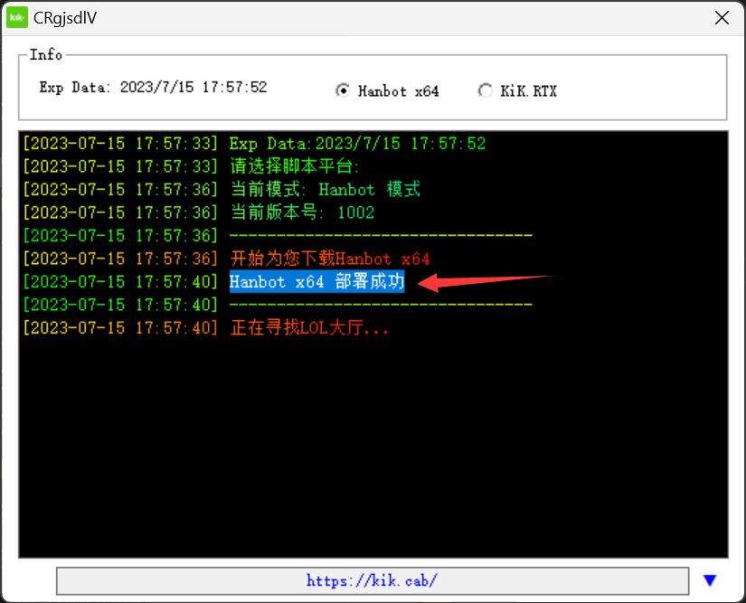
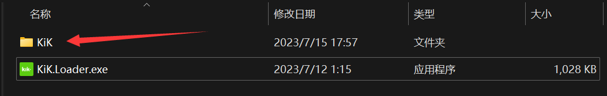
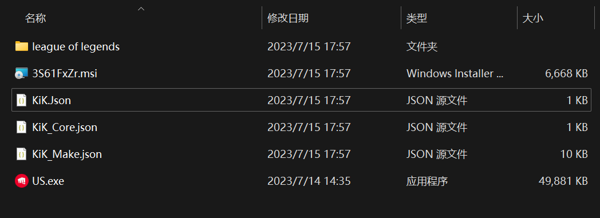

#### 此篇指南会告知你使用US等第三方缓存工具
1. 在你成功登录KiK之后,并且选择**Hanbot x64**之后,  
     会自动帮你下载**Hanbot x64**以及所有的脚本库  
     如果一切正常 则会提示 `Hanbot x64 部署成功` (如下图所示)
       

2. 此时你的KiK目录结构应该如下图所示
       

3. 此时进入到 `.\KiK` 文件夹内,你会见到如下的目录结构  
     

4. 其中 `league of legends` 文件夹即是 **Hanbot x64** 的 **工作目录**  
     你应该将US文件按照如图所示放在 `.\KiK` 目录下,注意不是 `league of legends` 内  

5. **运行Us或其它第三方缓存,享受游戏吧**
