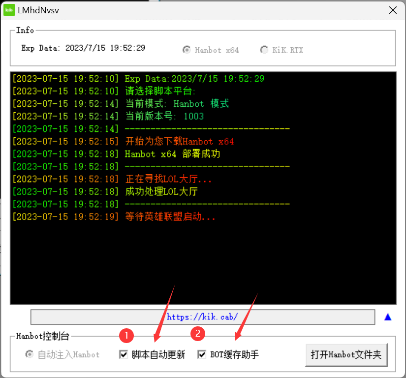

#### 此篇指南会告知你如何开启/关闭 BOT自动更新脚本/BOT配置工具
1. 在你成功登录KiK之后,在KiK界面的右下角有一个 `▼`  
     点击这个 `▼` 会打开Hanbot控制台,如下图所示   

       

2. **通过选中这两个选择框即可开关这两个功能**
    :::tip
    如果你使用US等第三方缓存工具,我建议你关闭这两个功能
    可以显著的提升注入速度
    :::

